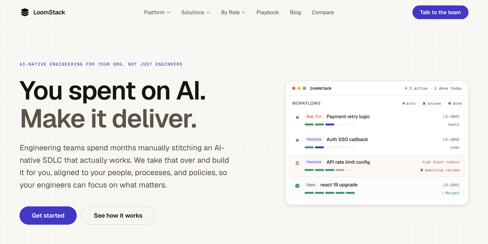

# Abhishek Verma

**Staff Engineer · Founder · AI Platforms**

Bengaluru, India

 

 

I've built products from zero to millions of users, led AI systems at Amazon scale, and run engineering orgs as both Staff Engineer and founder. I care about platforms that compound - agentic systems, RAG that holds up in production, and architecture that teams can actually ship on.

---

## Impact at a glance

<table>
  <tr>
    <td align="center" width="25%"> 
      <h3>3M+</h3>
      
users on products I founded

       
    </td>
    <td align="center" width="25%"> 
      <h3>40+</h3>
      
engineers led as Staff at Interface.AI

       
    </td>
    <td align="center" width="25%"> 
      <h3>98%+</h3>
      
Graph RAG accuracy for banking

       
    </td>
    <td align="center" width="25%"> 
      <h3>5×</h3>
      
eng productivity via agentic product engineering

       
    </td>
  </tr>
  <tr>
    <td align="center"> 
      <h3>GenAI Kindle</h3>
      
led first-gen AI-enabled Kindle at Amazon

       
    </td>
    <td align="center"> 
      <h3>>99.99%</h3>
      
uptime on voice AI interview platform

       
    </td>
    <td align="center"> 
      <h3>Amazon Fresh</h3>
      
led fraud & abuse systems for stores

       
    </td>
    <td align="center"> 
      <h3>Featured on</h3>
      
Gizmodo · Lifehacker · XDA

       
    </td>
  </tr>
</table>

---

## Experience

<table width="100%">
  <tr>
    <td>
       <strong><a href="https://dobr.ai">Dobr.AI</a></strong> · Founder &amp; CTO · <code>2024 – Present</code>
        
      Voice-based AI technical interviewing. Built cloud-native AWS microservices for thousands of concurrent interviews, an in-house agent orchestration framework (~1.5s latency), and cheating-detection via behavioral signals and validation agents.
    </td>
  </tr>
  <tr>
    <td>
       <strong><a href="https://interface.ai">Interface.AI</a></strong> · Staff Software Engineer · <code>2025 – 2026</code>
        
      Technical leader for a 40+ person India engineering org. Owned feasibility → POC → pilot → production (90%+ on-time, 70%+ pilot-to-production). Built Auto Product Engineering (agentic feature delivery, 5× productivity) and a Graph RAG knowledge platform for banking (98%+ accuracy).
    </td>
  </tr>
  <tr>
    <td>
       <strong>Amazon</strong> · Tech Lead · <code>2020 – 2024</code>
        
      Led GenAI workflows for the first-generation GenAI-enabled Kindle (LLMs, agents, safety). Built fraud &amp; abuse prevention for AWS self-checkout / Amazon Fresh. Automated receipt ground-truthing for Amazon GO (50% less associate effort, 3 days → 1 day). Led teams of 4–5 SDEs.
    </td>
  </tr>
  <tr>
    <td>
       <strong>Blurbsh</strong> · Founding Engineer · <code>2019</code>
        
      First engineer. Mobile apps and backend routing redesign (&gt;30% latency reduction).
    </td>
  </tr>
  <tr>
    <td>
       <strong>Inpen</strong> · Founder · <code>2014 – 2017</code>
        
      Solo-built Android utilities to <strong>3M+</strong> users. Featured on Gizmodo, Lifehacker, and XDA. Recognized at IIT Madras and IIT Mandi.
    </td>
  </tr>
</table>

---

## Building

<table width="100%">
  <tr>
    <td width="50%" valign="top">
      
       
      <strong><a href="https://github.com/abhishek-verma/Pane">Pane</a></strong>
       
      Browser with a soul. Open-source Chromium fork where the agent is native to your work: persona, memory, skills, and profiles on your machine. No Pane account. No Pane cloud.
    </td>
    <td width="50%" valign="top">
      
       
      <strong><a href="https://loomstack.co">LoomStack</a></strong>
       
      Orchestration layer for AI-native engineering. Context, policy, and observability across the AI-driven SDLC. Early-stage exploration.
    </td>
  </tr>
</table>

---

## Where I add the most leverage

<table width="100%">
  <tr>
    <td width="50%" valign="top">
      <strong>Agentic systems &amp; voice AI</strong> 
      End-to-end agents that hold up in production, not demos.
    </td>
    <td width="50%" valign="top">
      <strong>LLM / RAG platforms</strong> 
      Graph RAG, evals, and pipelines tuned for real accuracy.
    </td>
  </tr>
  <tr>
    <td valign="top">
      <strong>Platform engineering</strong> 
      Event-driven backends and systems teams can ship on.
    </td>
    <td valign="top">
      <strong>Fraud, trust &amp; safety</strong> 
      Detection and abuse systems at retail / marketplace scale.
    </td>
  </tr>
  <tr>
    <td colspan="2" valign="top">
      <strong>0→1 product + Staff-level strategy</strong> 
      Founder depth with architecture, tradeoffs, and team leverage.
    </td>
  </tr>
</table>

---

## Stack

  <strong>Languages</strong> 
  
  
  
  

  <strong>AI</strong> 
  
  
  
  
  
  

  <strong>Backend</strong> 
  
  
  
  
  
  

  <strong>Cloud</strong> 
  
  
  
  

  <strong>Frontend</strong> 
  
  

---

## Writing

I write about AI engineering, platforms, and building in public on <a href="https://jrnull.substack.com">Substack</a> (<a href="https://substack.com/@vrabhi">@vrabhi</a>).

### Recent articles

<table width="100%">
  <tr>
    <td width="28%" valign="middle">
      
    </td>
    <td valign="middle">
      <strong><a href="https://jrnull.substack.com/p/microsoft-killed-claude-code-for">Microsoft killed Claude Code for 100,000 engineers</a></strong>
       
      The token bills are the symptom. The real problem is coordination.
    </td>
  </tr>
  <tr>
    <td width="28%" valign="middle">
      
    </td>
    <td valign="middle">
      <strong><a href="https://jrnull.substack.com/p/architecting-llm-systems-for-scale">Architecting LLM systems for scale</a></strong>
       
      Selective routing and LLM–SLM collaboration for cost-efficient AI infra.
    </td>
  </tr>
</table>

---

## Let's talk

Open to **Staff Engineer** and **Director of Engineering** roles where deep IC work, platform architecture, and technical strategy matter - especially AI-native and platform-heavy teams.

 

